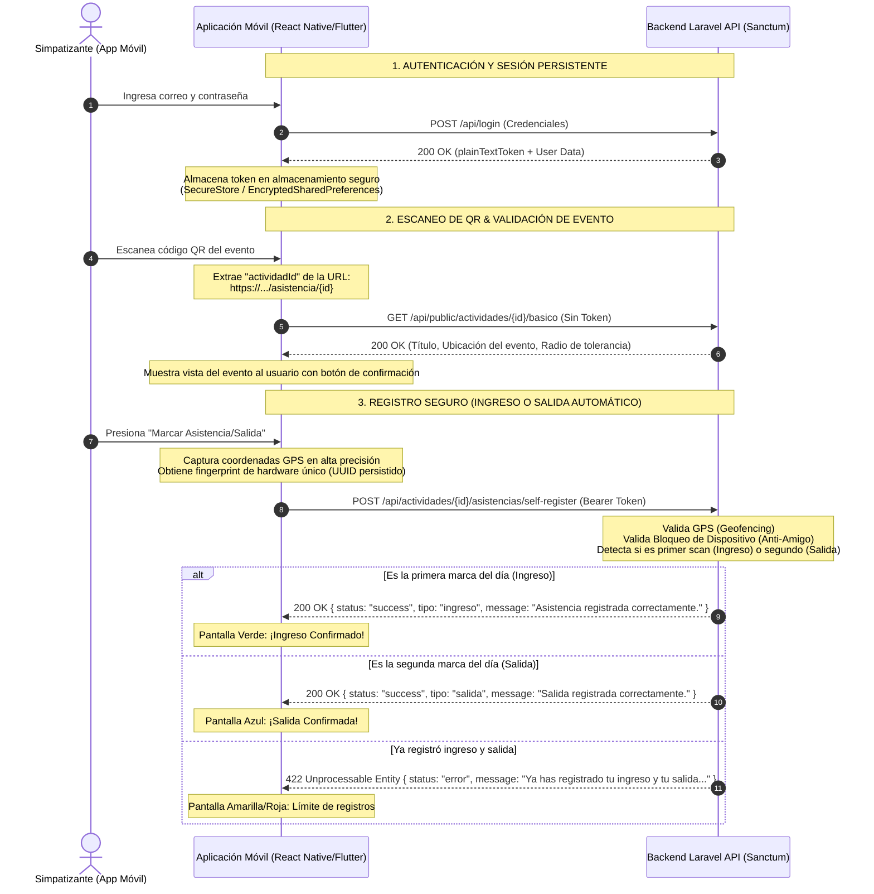
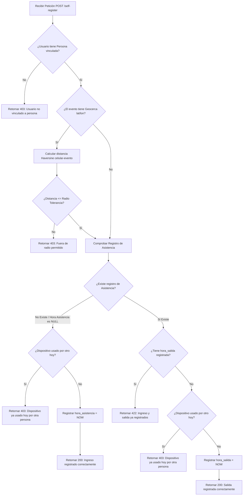

# 📱 Guía de Integración y Documentación de la API: Flujo de Asistencias (Mobile)

Esta guía establece el diseño técnico, flujos de datos y especificaciones detalladas de la API para la futura **aplicación móvil de control de asistencias**. El backend del sistema está construido sobre **Laravel 11+** y utiliza **Laravel Sanctum** para autenticación stateless, permitiendo un flujo híbrido seguro (Ingreso/Salida) con protección contra fraudes remotos.

---

## 🏛️ 1. Arquitectura de Integración Móvil

La aplicación móvil operará como un cliente API *stateless* e interactuará con el backend siguiendo esta topología:



---

## 🔐 2. Guía de Autenticación (Laravel Sanctum)

La API es completamente *stateless*. Toda petición protegida debe incluir la cabecera `Authorization: Bearer <token_obtenido>`.

### 2.1. Inicio de Sesión (Login)
*   **Endpoint:** `POST /api/login`
*   **Acceso:** Público (Sin token)
*   **Propósito:** Intercambiar credenciales por un token de acceso permanente de Sanctum.
*   **Regla Especial de Sesión Única:** El backend revoca automáticamente todos los tokens móviles previos del usuario al iniciar sesión en un nuevo dispositivo para evitar cuentas compartidas (`$user->tokens()->delete()`).

#### Petición (Payload):
```json
{
  "email": "juan.perez@gestionpolitica.com",
  "password": "mi_password_segura"
}
```

#### Respuesta Exitosa (`200 OK`):
```json
{
  "token": "4|c3ZgUXBqQ1I1c0g2NmpxbVp3Q0d5SjkyT3N2YnVzRTM=",
  "user": {
    "id": 15,
    "name": "Juan Pérez",
    "email": "juan.perez@gestionpolitica.com",
    "roles": ["simpatizante"],
    "permissions": ["actividades:asistencia-self"],
    "allowed_sectors": [],
    "allowed_bases": []
  }
}
```

#### Respuesta de Error (`401 Unauthorized`):
```json
{
  "message": "Credenciales inválidas."
}
```

### 2.2. Cerrar Sesión (Logout)
*   **Endpoint:** `POST /api/logout`
*   **Acceso:** Protegido (`auth:sanctum`)
*   **Propósito:** Revocar e invalidar el token actual en la base de datos.
*   **Cabeceras:** `Authorization: Bearer <token>`

#### Respuesta Exitosa (`200 OK`):
```json
{
  "message": "Sesión cerrada correctamente."
}
```

### 2.3. Perfil de Sesión Activa (Me)
*   **Endpoint:** `GET /api/me`
*   **Acceso:** Protegido (`auth:sanctum`)
*   **Propósito:** Verificar que el token guardado localmente en el móvil sigue siendo válido al abrir la app.
*   **Cabeceras:** `Authorization: Bearer <token>`

#### Respuesta Exitosa (`200 OK`):
```json
{
  "user": {
    "id": 15,
    "name": "Juan Pérez",
    "email": "juan.perez@gestionpolitica.com",
    "roles": ["simpatizante"],
    "permissions": ["actividades:asistencia-self"]
  }
}
```

#### Respuesta de Error (Token Expirado/Revocado) (`401 Unauthorized`):
```json
{
  "message": "Unauthenticated."
}
```

> [!TIP]
> **Estrategia Mobile (Cero Fricción):** Guarda el `token` devuelto por el login en el almacenamiento seguro de la plataforma móvil (`Flutter Secure Storage` o `Expo SecureStore` / `Keychain`/`Keystore`). En cada inicio de la app móvil, realiza un `GET /api/me` en segundo plano. Si responde `200 OK`, el usuario entra directamente a la app. Si responde `401 Unauthorized`, redirígelo a la pantalla de Login.

---

## 📡 3. Guía de Uso del Flujo de Asistencia (Ingreso y Salida)

Este flujo se ejecuta en la aplicación cuando el simpatizante escanea el código QR de un local o evento.

### 3.1. Obtención de Datos Básicos del Evento (Pre-validación de QR)
*   **Endpoint:** `GET /api/public/actividades/{actividadId}/basico`
*   **Acceso:** Público (Sin token)
*   **Propósito:** Tras escanear el QR, la app debe extraer el ID de la URL y llamar a este endpoint para mostrar un resumen visual del evento y comprobar sus parámetros físicos (Geocercas).

#### Respuesta Exitosa (`200 OK`):
```json
{
  "status": "success",
  "data": {
    "id": 8,
    "titulo": "Gran Mitin Tacna Heroica",
    "descripcion": "Reunión de coordinación de bases territoriales tacneñas.",
    "fecha_actividad": "2026-05-20 18:00:00",
    "es_publica": true,
    "latitud": -18.01358900,
    "longitud": -70.25102500,
    "radio_asistencia_metros": 150,
    "foto_portada_url": "https://server.domain/storage/actividades/mitin.jpg"
  }
}
```

---

### 3.2. Auto-registro con QR (Marcación Inteligente: Ingreso / Salida)
*   **Endpoint:** `POST /api/actividades/{actividadId}/asistencias/self-register`
*   **Acceso:** Protegido (`auth:sanctum` - Requiere permiso `actividades:asistencia-self`)
*   **Cabeceras:**
    *   `Authorization: Bearer <token>`
    *   `Content-Type: application/json`
    *   `Accept: application/json`

#### Petición (Payload):
```json
{
  "latitud_usuario": -18.01362000,
  "longitud_usuario": -70.25101000,
  "browser_fingerprint": "native_device_uuid_8fa9db62"
}
```

#### Parámetros Requeridos:
1.  `latitud_usuario` y `longitud_usuario` (Decimales): Coordenadas GPS del celular capturadas con precisión fina.
2.  `browser_fingerprint` (String): El identificador único de hardware del celular del simpatizante (Ver Sección 4 para su generación nativa). Sirve de escudo **Anti-Amigo**.

---

### ⚙️ Lógica Dinámica del Backend (Ingreso vs Salida)
Al recibir la petición, el backend ejecuta secuencialmente las siguientes validaciones profesionales:



---

### 📥 3.3. Respuestas Detalladas de la API (`/self-register`)

#### Escenario A: Registro de Ingreso Exitoso (Primer escaneo) (`200 OK`)
```json
{
  "status": "success",
  "message": "Asistencia registrada correctamente.",
  "tipo": "ingreso",
  "data": {
    "id": 42,
    "actividad_id": 8,
    "sujeto_id": 120,
    "sujeto_type": "App\\Models\\Persona",
    "hora_asistencia": "2026-05-19T00:51:20.000000Z",
    "hora_salida": null,
    "metodo_registro": "qr_self_service",
    "latitud_capturada": "-18.01362000",
    "longitud_capturada": "-70.25101000",
    "device_fingerprint": "native_device_uuid_8fa9db62",
    "sujeto": {
      "id": 120,
      "nombre_completo": "Juan Pérez",
      "dni": "70281938"
    }
  }
}
```

#### Escenario B: Registro de Salida Exitoso (Segundo escaneo del mismo evento) (`200 OK`)
```json
{
  "status": "success",
  "message": "Salida registrada correctamente.",
  "tipo": "salida",
  "data": {
    "id": 42,
    "actividad_id": 8,
    "sujeto_id": 120,
    "sujeto_type": "App\\Models\\Persona",
    "hora_asistencia": "2026-05-19T00:51:20.000000Z",
    "hora_salida": "2026-05-19T21:45:00.000000Z",
    "metodo_registro": "qr_self_service",
    "latitud_capturada": "-18.01362000",
    "longitud_capturada": "-70.25101000",
    "device_fingerprint": "native_device_uuid_8fa9db62",
    "sujeto": {
      "id": 120,
      "nombre_completo": "Juan Pérez",
      "dni": "70281938"
    }
  }
}
```

#### Escenario C: Denegación por Fraude de Dispositivo (Anti-Amigo) (`403 Forbidden`)
*Ocurre si otra persona intentó usar la app del celular de un amigo para marcar asistencia por él en el mismo día.*
```json
{
  "status": "error",
  "message": "Este dispositivo ya fue usado para registrar la asistencia de otra persona hoy."
}
```

#### Escenario D: Denegación por Distancia Excesiva (Anti-Casa) (`403 Forbidden`)
*Ocurre si el GPS del celular indica que está a más de los metros configurados para el evento.*
```json
{
  "status": "error",
  "message": "Estás fuera del radio permitido para marcar tu asistencia o salida."
}
```

#### Escenario E: Límite de Escaneos Alcanzado (`422 Unprocessable Entity`)
*Ocurre si el simpatizante ya registró su ingreso y su salida e intenta escanear el QR por tercera vez.*
```json
{
  "status": "error",
  "message": "Ya has registrado tu ingreso y tu salida para este evento."
}
```

---

## 🛠️ 4. Guía de Implementación Móvil (Frontend / Native Client)

### 4.1. Generación Segura de `device_fingerprint` en Mobile
Para evitar fraudes en entornos móviles nativos sin depender de las cookies del navegador web, la aplicación debe generar y persistir un identificador de hardware persistente.

#### En **React Native** (usando `expo-application` y `expo-secure-store`):
```javascript
import * as Application from 'expo-application';
import * as SecureStore from 'expo-secure-store';
import * as Crypto from 'expo-crypto';

async function getMobileFingerprint() {
  // Intentar obtener el UUID guardado de forma segura en la bóveda nativa
  let deviceUuid = await SecureStore.getItemAsync('device_fingerprint');
  
  if (!deviceUuid) {
    // Generar un UUID nativo único basado en hardware
    if (Platform.OS === 'android') {
      deviceUuid = Application.androidId; // ID persistente por instalación
    } else {
      deviceUuid = await Application.getIosIdForVendorAsync(); // ID persistente por Vendor (Apple standard)
    }
    
    // Si falla el ID nativo por permisos, generar un UUID criptográfico seguro
    if (!deviceUuid) {
      deviceUuid = Crypto.randomUUID();
    }
    
    // Guardar para futuros usos en el SecureStore (encriptado a nivel hardware)
    await SecureStore.setItemAsync('device_fingerprint', deviceUuid);
  }
  
  return `mobile_native_${deviceUuid}`;
}
```

#### En **Flutter** (usando `device_info_plus` y `flutter_secure_storage`):
```dart
import 'dart:io';
import 'package:device_info_plus/device_info_plus.dart';
import 'package:flutter_secure_storage/flutter_secure_storage.dart';
import 'package:uuid/uuid.dart';

Future<String> getMobileFingerprint() async {
  final storage = const FlutterSecureStorage();
  String? deviceUuid = await storage.read(key: 'device_fingerprint');

  if (deviceUuid == null) {
    final deviceInfo = DeviceInfoPlugin();
    if (Platform.isAndroid) {
      final androidInfo = await deviceInfo.androidInfo;
      deviceUuid = androidInfo.id; // UUID único de placa de Android
    } else if (Platform.isIOS) {
      final iosInfo = await deviceInfo.iosInfo;
      deviceUuid = iosInfo.identifierForVendor; // UUID seguro provisto por iOS
    }

    // Backup por seguridad
    deviceUuid ??= const Uuid().v4();

    // Guardar de forma encriptada nativa
    await storage.write(key: 'device_fingerprint', value: deviceUuid);
  }

  return 'mobile_native_$deviceUuid';
}
```

---

### 📍 4.2. Buenas Prácticas del GPS en Dispositivos Móviles
Los smartphones tienen diferentes niveles de precisión GPS. Para evitar falsos rechazos en la geocerca:
1.  **Solicitar Alta Precisión:** Configura la captura del GPS móvil con precisión *fina* (`highAccuracy: true` / `LocationAccuracy.high` en Flutter).
2.  **Verificación de Edad de Coordenadas:** Descarta coordenadas guardadas en memoria caché (`maximumAge: 0`) para garantizar que el usuario no está enviando una ubicación vieja mientras viaja en auto hacia el lugar.
3.  **Manejo de Contextos HTTP:** Aunque en web el GPS requiere obligatoriamente HTTPS (entornos de producción), en aplicaciones nativas iOS y Android, el framework permite acceder al GPS directamente sin restricciones de SSL (ideal para entornos de prueba local del backend con IPs directas como `http://192.168.1.X:8000`).

---

### 📴 4.3. Estrategia Offline (Alta Escala e Inestabilidad de Red)
En eventos políticos masivos, la señal móvil (3G/4G/5G) suele saturarse por completo. Un sistema profesional debe contar con tolerancia a fallas de red:

1.  **Validación de QR local:** Cuando la app escanea el QR y no tiene conexión a internet para resolver el endpoint de pre-validación de la actividad (3.1), la app debe:
    *   Extraer el `actividadId`.
    *   Guardar de forma local temporal el registro en una cola SQLite/Realm con las coordenadas actuales capturadas por GPS y un timestamp de hardware (`NOW` del dispositivo).
2.  **Sincronización en Cola de Espera (Queue):** 
    *   Una vez que el celular recupere señal estable de internet, la app móvil enviará secuencialmente todos los registros encolados al backend.
    *   *Nota técnica:* Para marcas en diferido, se debe usar un endpoint alternativo que acepte un timestamp manual si se desea auditar la hora real local capturada nativamente, o bien procesarlo directamente en línea en cuanto vuelva la conexión.

---

### 🎨 4.4. Diseño de la Experiencia de Usuario (UI Premium)
Para lograr un impacto visual inmediato y facilitar el proceso a personas de todas las edades en la mesa de control o en auto-registro:

*   **Paso 1: Scanner Integrado:** No saques al usuario al navegador web del sistema. Integra la cámara directamente en la app (`react-native-camera` o `mobile_scanner` en Flutter) con una guía rectangular verde animada flotando en pantalla.
*   **Paso 2: Transición de Confirmación:** Tras escanear, muestra una tarjeta premium y flotante con efecto *Glassmorphism* que identifique el evento y su local territorial.
*   **Paso 3: Pantallas de Estado Haptificadas (Feedback Vibratorio):**
    *   **Ingreso Exitoso:** Pantalla verde con un check gigante animado. Reproducir vibración ligera (`hapticFeedback.success`) y sonido de campana positiva.
    *   **Salida Exitosa:** Pantalla azul brillante con un icono de puerta de salida. Reproducir vibración doble y sonido suave de marcación rápida.
    *   **Error / Bloqueo:** Pantalla roja/naranja con un icono de advertencia. Vibración fuerte y larga con un sonido seco para alertar al usuario que su marca fue rechazada.
